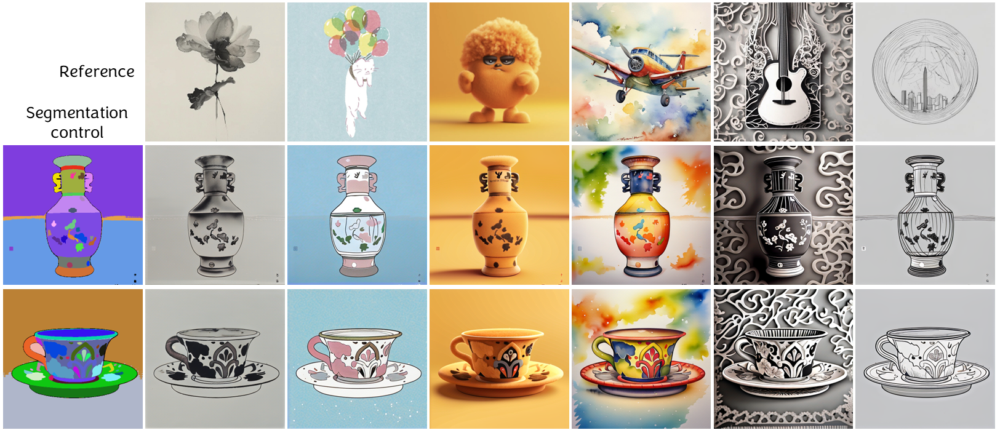

<div align="center">
<h1>StyleAR: Customizing Multimodal Autoregressive Model for Style-Aligned Text-to-Image Generation</h1>

**Yi Wu** · **Lingting Zhu** · **Shengju Qian** · **Lei Liu** · **Wandi Qiao** · **Lequan Yu** · **Bin Li**

</div>

StyleAR is a framework that enables the multimodal autoregressive model to perform style-aligned text-to-image generation.

<div align="center">

</div>

## 🔥 Release
- [2025/05/27] 🎉 We release the infernce code and checkpoints.
- [2025/05/27] 🎉 We release the [technical report](https://arxiv.org/abs/2505.19874).

## 🧰 Models
|Base Model| Task Type | Resolution | Checkpoint |
|:---------|:---------|:--------|:--------|
|[Lumina-mGPT](https://huggingface.co/Alpha-VLLM/Lumina-mGPT-7B-768)| Reference Style |768x768|[Hugging Face](https://huggingface.co/Ani2017/StyleAR)|

## ⚙️ Setup
The code relies on the implementation of [Lumina-mGPT](https://github.com/Alpha-VLLM/Lumina-mGPT/tree/main), the setup procedure is the same.
### 1. Basic Setup

```
# Create a new conda environment named 'stylear' with Python 3.10
conda create -n stylear python=3.10 -y
# Activate the 'stylear' environment
conda activate stylear
# Install required packages from 'requirements.txt'
pip install -r requirements.txt
```

### 2. Install Flash-Attention
```
pip install flash-attn --no-build-isolation
```

### 3. Install xllmx as Python Package
The [xllmx](./xllmx) module is a lightweight engine designed to support the training and inference of
LLM-centered Any2Any models. It is evolved from [LLaMA2-Accessory](https://github.com/Alpha-VLLM/LLaMA2-Accessory), undergoing comprehensive improvements to achieve higher efficiency and
wider functionality, including the support for flexible arrangement and processing of interleaved media and text.

The Lumina-mGPT implementation heavily relies on xllmx and requires xllmx to be installed as a python package (**so that `import xllmx` can be used anywhere in your machine, without the restriction of working directory**).
The installation process is as follows:
```bash
# go to the root path of the project and install as package
pip install -e .
```

### 4. Model Perpetration
Since currently the Chameleon implementation in transformers does not contain the VQ-VAE decoder, please manually download the original VQ-VAE weights [provided by Meta](https://github.com/facebookresearch/chameleon) and
put them to the following directory:

```
StyleAR
- lumina_mgpt/
    - ckpts/
        - chameleon/
            - tokenizer/
                - text_tokenizer.json
                - vqgan.yaml
                - vqgan.ckpt
- xllmx/
- ...
```

Then download the stylear models from [Hugging Face](https://huggingface.co/Ani2017/StyleAR) and put them to 'stylear_models' directory:

```
StyleAR
- lumina_mgpt/
    - ckpts/
    - stylear_models/
        - image_proj.pth
        - model.safetensors
- xllmx/
- ...
```

## 💫 Inference
```
python inference.py --params_path "{stylear_params_path}" --style "{reference_style_image}" --prompt "{prompt}" --save_path "{save_path}"
# samples
python inference.py --params_path stylear_models --style ../test_images/doll.png --prompt "a ship" --noise_strength 0.3 --save_path output
python inference.py --params_path stylear_models --style ../test_images/airplane.png --prompt "a train" --noise_strength 0.3 --save_path output
python inference.py --params_path stylear_models --style ../test_images/owl.png --prompt "a dog" --noise_strength 0.1 --save_path output
```

## 🔆 Demos

### 1. Comparison with Previous Works

<p align="center">
  
</p>

### 2. Integrate with Depth Condition

<p align="center">
  
</p>

### 3. Integrate with Segmentation map Condition

<p align="center">
  
</p>


## 📝 To-Do List
 - [x] Style-driven Text-to-Image Generation Inference Code & Checkpoints
 - [x] Technical Report
 - [ ] StyleAR Integration with Depth Control Inference Code & Checkpoints
 - [ ] StyleAR Integration with Segmentation Map Control Inference Code & Checkpoints
 - [ ] StyleAR Based on [Lumina-mGPT 2.0](https://github.com/Alpha-VLLM/Lumina-mGPT-2.0)


## Citation

If you find our work useful, please kindly cite as:
```
@article{wu2025stylear,
  title={StyleAR: Customizing Multimodal Autoregressive Model for Style-Aligned Text-to-Image Generation},
  author={Wu, Yi and Zhu, Lingting and Qian, Shengju and Liu, Lei and Qiao, Wandi and Yu, Lequan and Li, Bin},
  journal={arXiv preprint arXiv:2505.xxxxx},
  year={2025}
}

```

## Related Links
If you are interested in **Personalized Image Generation with AR Models**, we would also like to recommend you to check out our related work:

* [Proxy-Tuning: Tailoring Multimodal Autoregressive Models for Subject-Driven Image Generation](https://arxiv.org/abs/2503.10125).
